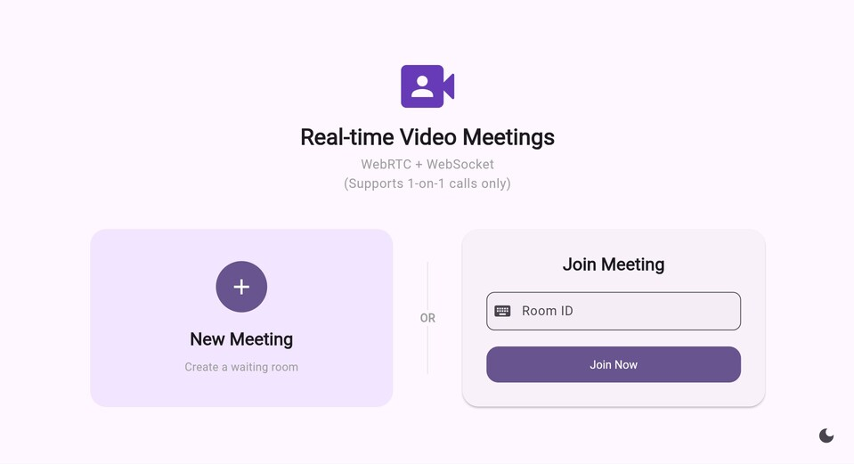
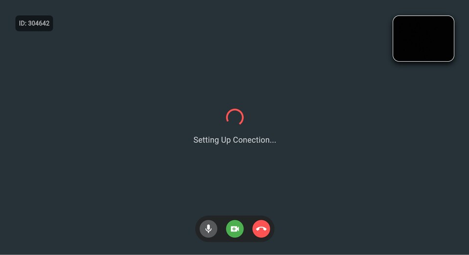

# Video Call

A real-time video calling application using **WebRTC**. Simply create a room and share the ID with a partner to connect.

> **Note:** This project supports **1-on-1** calls only.\
> **Caution:** To resolve ICE candidate race conditions problem (i guess) The implementation forced renegotiation (sending the offer twice) this prevent initial black screen issue by ensuring that video tracks are properly attached to peerConnection

## Frameworks
* **Frontend:** Flutter (FlutterWebRTC + GetX)
* **Backend:** Spring Boot Kotlin (WebSocket for Signaling)

## Screenshots

| Create / Join   | Video Call |
|:---:|:---:|
|  |  |